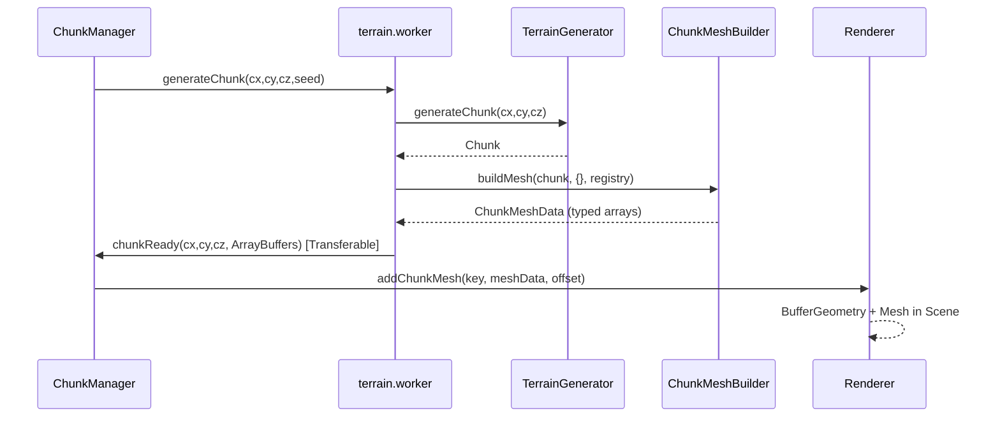

# feat: Add rendering pipeline with greedy meshing

## Overview

Build the complete rendering pipeline: greedy mesh builder (Web Worker safe), texture atlas generation, Three.js renderer, worker-based chunk generation, and a ChunkManager that orchestrates loading. This is the most algorithm-intensive phase — the greedy meshing implementation is the critical path.

## Problem Frame

The engine has world storage (Chunk), terrain generation (TerrainGenerator, StructureGenerator), and all supporting data layers — but no way to visualize the world. This phase bridges the data layer to screen pixels via a Web Worker pipeline that generates chunks off-thread and a Three.js renderer that displays the merged mesh geometry.

## Requirements Trace

- R1. ChunkMeshBuilder converts Chunk block data into renderable vertex arrays (positions, normals, UVs, indices) using greedy meshing — no Three.js imports
- R2. Greedy meshing: for each face direction, build a 16x16 mask of visible faces, merge adjacent same-type faces into larger quads, emit 2 triangles per merged quad
- R3. Neighbor-aware face culling: only render faces where current block is solid and adjacent block (including across chunk boundaries) is not solid or is transparent
- R4. Texture atlas: 9 placeholder 16x16 PNGs packed into a grid atlas with generated UV coordinate map
- R5. TextureAtlas class loads the atlas as a Three.js texture with NearestFilter (pixel art) and provides UV lookups by block face
- R6. Renderer manages WebGLRenderer, Scene, Camera, lighting, and chunk meshes with a shared MeshLambertMaterial
- R7. Web Worker generates chunks and builds meshes off-thread, posting ArrayBuffer results via Transferable
- R8. ChunkManager coordinates worker requests, tracks loaded chunks, and supports block get/set
- R9. Worker message protocol is typed (MainToWorker, WorkerToMain)
- R10. All mesh-building code must be Web Worker safe (no Three.js, no DOM)

## Scope Boundaries

- No player controller or input handling (Phase 5)
- No chunk LOD, frustum culling, or dynamic load/unload radius
- No water rendering or transparency sorting
- No ambient occlusion or lighting baking
- No real texture art — placeholder solid colors only
- MVP loads all 64 chunks (4x4x4) at startup; no streaming

## Context & Research

### Relevant Code and Patterns

- `src/engine/world/Chunk.ts` — `getBlock(lx, ly, lz)`, `getBlockData()`, chunk coordinates
- `src/lib/coords.ts` — `localToIndex`, `worldToChunk`, `worldToLocal`, `chunkKey` — all Web Worker safe (zero imports)
- `src/engine/world/constants.ts` — `CHUNK_SIZE` (16), `CHUNK_VOLUME` (4096)
- `src/data/blocks.ts` — `BLOCK_ID`, `BLOCK_DEFINITIONS`, `BlockDefinition.textures` with top/bottom/side names
- `src/engine/world/BlockRegistry.ts` — `isSolid(id)`, `isTransparent(id)`, `getBlock(id)` for face visibility decisions
- `src/engine/generation/TerrainGenerator.ts` — generates Chunk instances from seed

### Institutional Learnings

- **Path aliases in Vite vs TypeScript**: Use `@lib/coords` not `@lib/coords/*` in Vite alias keys (see `docs/solutions/best-practices/path-alias-syntax-typescript-vs-vite-2026-04-05.md`)
- **Web Worker safety**: Keep coordinate/math files import-free — hardcode constants like chunk size as literals when needed in worker context (see `docs/solutions/best-practices/voxel-coordinate-math-patterns-2026-04-05.md`)
- **COOP/COEP headers**: Already configured in vercel.json for SharedArrayBuffer support on `/game(.*)` routes (see `docs/solutions/best-practices/vercel-headers-nested-route-matching-2026-04-05.md`)

## Key Technical Decisions

- **Greedy meshing over naive meshing**: Reduces quad count dramatically (a full solid chunk produces 6 face quads instead of 6 * 16^2 = 1536). Critical for GPU performance.
- **Pre-allocated arrays with write cursors**: Avoids GC pressure from Array.push() in the hot mesh-building loop. Allocate to max possible size, trim at end.
- **ChunkMeshBuilder is Three.js-free**: Runs in Web Worker. Returns raw typed arrays that the main thread wraps in BufferGeometry.
- **Single shared MeshLambertMaterial**: All chunk meshes share one material with the atlas texture. Minimizes draw call overhead.
- **Worker caches TerrainGenerator by seed**: Avoids re-initializing noise tables per chunk request.
- **Transferable ArrayBuffers for worker→main**: Zero-copy transfer of mesh data. Buffers become neutered in the worker after posting.
- **sharp for atlas generation**: Node.js script generates PNGs programmatically — no manual asset pipeline needed. Dev dependency only.
- **getUV callback on buildMesh**: Decouples mesh builder from atlas. Worker passes a stub; main thread can pass real atlas UVs for re-mesh operations.

## High-Level Technical Design

> *This illustrates the intended approach and is directional guidance for review, not implementation specification. The implementing agent should treat it as context, not code to reproduce.*

### Greedy Meshing Algorithm Shape

> *Directional guidance for the core algorithm, not implementation specification.*

For each of 6 face directions:
1. Iterate slices perpendicular to the face normal (16 slices per direction)
2. Build a 16x16 mask: cell is non-zero (block ID) if that face should be rendered (current block solid, neighbor not solid/transparent). Look up neighbor chunks for boundary faces.
3. Greedy merge: scan mask left-to-right, top-to-bottom. For each unvisited non-zero cell, expand right while block IDs match, then expand the entire row downward while all cells in the extended row match. Mark visited. Emit one quad.
4. Per quad: 4 vertices at world positions, face normal, UV coordinates from the getUV callback using the block's texture name for that face direction.

## Open Questions

### Resolved During Planning

- **How does the worker access BlockRegistry (singleton)?** The worker creates its own BlockRegistry instance — `getInstance()` is safe since each worker has its own global scope.
- **How does buildMesh get UV coordinates in worker context?** Accept a `getUV` callback parameter. Worker passes a stub returning full [0,1] range. Main thread passes real atlas UVs for local re-mesh after block edits.
- **Atlas grid layout?** 4 columns, ceil(9/4) = 3 rows. Atlas is 64x48 pixels. UV coordinates are normalized fractions of the atlas dimensions.
- **How does setBlock trigger re-mesh?** ChunkManager does a synchronous main-thread re-mesh for immediate feedback using ChunkMeshBuilder directly (not via worker). Only the affected chunk is re-meshed.

### Deferred to Implementation

- **Exact max vertex/index array sizes for pre-allocation**: Theoretical max is 6 faces * 16^2 quads * 4 vertices = 6144 verts per chunk in worst case (no greedy merge). Implementation should calculate the tight bound.
- **Worker error recovery**: If worker posts an error, ChunkManager should retry or log. Exact retry policy left to implementation.
- **Next.js Turbopack compatibility with `new URL()` worker pattern**: May need testing — documented pattern may need adjustment for the project's bundler version.

## Implementation Units

### Phase A: Mesh Building (Worker-safe)

- [ ] **Unit 1: ChunkMeshData type and ChunkMeshBuilder with greedy meshing**

  **Goal:** Implement the greedy mesh algorithm that converts chunk block data to vertex arrays without Three.js dependency

  **Requirements:** R1, R2, R3, R10

  **Dependencies:** None (uses existing Chunk, BlockRegistry, coords)

  **Files:**
  - Create: `src/engine/renderer/ChunkMeshBuilder.ts`
  - Test: `src/tests/ChunkMeshBuilder.test.ts`

  **Approach:**
  - Export `ChunkMeshData` interface (positions, normals, uvs, indices as typed arrays + counts)
  - Static `buildMesh(chunk, neighbors, registry, getUV)` method
  - Six face directions as constant arrays: normal vector + two tangent axes (u, v) per face
  - For boundary lookups: if local coord is at edge (0 or 15), look up neighbor chunk; if no neighbor, treat as AIR
  - Pre-allocate output arrays to max size, use write cursor integers, slice at end
  - The getUV callback takes a texture name string and returns {u0, v0, u1, v1}. Default stub returns {0, 0, 1, 1}.
  - Import `localToIndex` from `@lib/coords`, `CHUNK_SIZE` from constants, `BlockRegistry` types

  **Execution note:** Start with a failing test for the single-solid-block case (6 faces, 24 vertices, 12 triangles) to anchor the algorithm.

  **Patterns to follow:**
  - `src/lib/coords.ts` — Web Worker safe, named exports, JSDoc
  - `src/engine/world/Chunk.ts` — typed array usage pattern

  **Test scenarios:**
  - Happy path: Single STONE block at (8,8,8) surrounded by AIR → 6 faces, 12 triangles (36 indices), 24 vertices
  - Happy path: Full solid chunk → faces only on 6 outer walls (no internal faces)
  - Happy path: Two adjacent same-type blocks in a row → greedy merge produces 1 wide quad on shared-direction faces instead of 2
  - Edge case: Empty chunk (all AIR) → vertexCount=0, indexCount=0
  - Edge case: Transparent block (LEAVES) adjacent to solid block → face IS rendered (not culled)
  - Edge case: Boundary face with neighbor chunk containing solid block → face is culled
  - Edge case: Boundary face with no neighbor (undefined) → face is rendered (treat missing as AIR)

  **Verification:**
  - All ChunkMeshBuilder tests pass
  - No Three.js imports in the file
  - `npx tsc --noEmit` passes

### Phase B: Texture Atlas

- [ ] **Unit 2: Atlas build script and UV data**

  **Goal:** Generate 9 placeholder textures, pack into atlas PNG, and generate UV coordinate map

  **Requirements:** R4

  **Dependencies:** None

  **Files:**
  - Create: `scripts/buildAtlas.ts`
  - Generated: `public/textures/atlas.png`
  - Generated: `src/data/atlasUVs.ts`

  **Approach:**
  - Install `sharp` as dev dependency
  - Each texture is a 16x16 solid color PNG (grass_side is split: top half green, bottom half brown)
  - Pack into 4-column grid: row 0 = [grass_top, grass_side, dirt, stone], row 1 = [sand, log_side, log_top, leaves], row 2 = [crystal_shard, empty, empty, empty]
  - Atlas total: 64x48 pixels
  - Generate `atlasUVs.ts` with `export const ATLAS_UVS: Record<string, {u0: number; v0: number; u1: number; v1: number}>` mapping each name to normalized UV rect
  - Script is runnable with `npx tsx scripts/buildAtlas.ts`

  **Patterns to follow:**
  - `src/data/blocks.ts` — named export pattern for data constants

  **Test expectation:** None — build script output verified by running it and checking generated files exist. The UV values are verified indirectly through mesh builder and renderer integration.

  **Verification:**
  - `npx tsx scripts/buildAtlas.ts` runs without error
  - `public/textures/atlas.png` and `src/data/atlasUVs.ts` exist with correct content
  - `npx tsc --noEmit` passes with the generated UV file

- [ ] **Unit 3: TextureAtlas class**

  **Goal:** Provide Three.js texture loading and UV lookup API for main thread rendering

  **Requirements:** R5

  **Dependencies:** Unit 2

  **Files:**
  - Create: `src/engine/renderer/TextureAtlas.ts`

  **Approach:**
  - Import Three.js (TextureLoader, NearestFilter, SRGBColorSpace)
  - Import `ATLAS_UVS` from `@data/atlasUVs`
  - Import `BlockRegistry` for block face texture name lookups
  - `load()` returns a Promise<THREE.Texture> with NearestFilter on both mag and min, SRGBColorSpace
  - `getUVs(textureName)` returns the UV rect from ATLAS_UVS
  - `getBlockFaceUVs(blockId, face)` looks up block definition texture name for the face, then calls getUVs

  **Patterns to follow:**
  - `src/engine/world/BlockRegistry.ts` — singleton with lookup methods

  **Test expectation:** None — requires DOM/WebGL environment. Verified through integration with Renderer.

  **Verification:**
  - `npx tsc --noEmit` passes
  - TextureAtlas correctly resolves block face → texture name → UV rect chain

### Phase C: Renderer

- [ ] **Unit 4: Renderer class**

  **Goal:** Manage Three.js scene, camera, lighting, materials, and chunk mesh objects

  **Requirements:** R6

  **Dependencies:** Unit 3

  **Files:**
  - Create: `src/engine/renderer/Renderer.ts`

  **Approach:**
  - Constructor takes HTMLCanvasElement, creates WebGLRenderer, Scene, PerspectiveCamera (FOV 75, near 0.1, far 300)
  - AmbientLight intensity 0.6, DirectionalLight intensity 0.8 at position (50, 80, 30)
  - Scene background: THREE.Color(0x87CEEB) (sky blue)
  - `init()` loads TextureAtlas, creates shared MeshLambertMaterial (atlas texture, FrontSide, alphaTest 0.5)
  - `addChunkMesh(key, meshData, offsetX, offsetY, offsetZ)` creates BufferGeometry from typed arrays, creates Mesh at world offset, stores in Map
  - `removeChunkMesh(key)` removes from scene, disposes geometry
  - `updateCamera(position, rotation)` — position is Vector3-like {x,y,z}, rotation is Euler-like {x,y,z}
  - `render()` calls renderer.render(scene, camera)
  - `resize(w, h)` updates camera aspect and renderer size
  - `dispose()` cleans up all meshes, renderer, materials, textures

  **Patterns to follow:**
  - Standard Three.js BufferGeometry attribute setup (setAttribute for position, normal, uv; setIndex)

  **Test expectation:** None — requires WebGL context. Verified through visual integration.

  **Verification:**
  - `npx tsc --noEmit` passes
  - All public methods have JSDoc

### Phase D: Worker Pipeline

- [ ] **Unit 5: Worker protocol types**

  **Goal:** Define typed message interfaces for main↔worker communication

  **Requirements:** R9

  **Dependencies:** None

  **Files:**
  - Create: `src/engine/workers/workerProtocol.ts`

  **Approach:**
  - `MainToWorker` union type: `{ type: 'generateChunk', cx, cy, cz, seed, requestId }`
  - `WorkerToMain` union type: `{ type: 'chunkReady', cx, cy, cz, meshData: ChunkMeshData, requestId }` | `{ type: 'error', message: string, requestId: string }`
  - Export `ChunkMeshData` re-export or reference from ChunkMeshBuilder
  - Pure type file — no runtime code

  **Patterns to follow:**
  - Discriminated union pattern with `type` field

  **Test expectation:** None — pure type definitions.

  **Verification:**
  - `npx tsc --noEmit` passes

- [ ] **Unit 6: Terrain worker**

  **Goal:** Web Worker that generates chunks and builds meshes off-thread

  **Requirements:** R7, R10

  **Dependencies:** Unit 1, Unit 5

  **Files:**
  - Create: `src/engine/workers/terrain.worker.ts`

  **Approach:**
  - Listen for `message` events typed as `MainToWorker`
  - Cache `TerrainGenerator` by seed string (Map or single-value cache since MVP uses one seed)
  - On `generateChunk`: create/reuse TerrainGenerator, generate chunk, build mesh with empty neighbors and stub getUV, post `chunkReady` with Transferable ArrayBuffers
  - On error: catch and post `error` message with requestId
  - Worker file uses `self.onmessage` / `self.postMessage`
  - All imports must be Web Worker safe (no Three.js, no DOM)

  **Patterns to follow:**
  - `src/lib/coords.ts`, `src/lib/noise.ts` — Web Worker safe imports

  **Test expectation:** None — worker execution requires browser runtime. Verified through ChunkManager integration.

  **Verification:**
  - `npx tsc --noEmit` passes
  - No Three.js or DOM imports in the file or its transitive dependencies

- [ ] **Unit 7: ChunkManager**

  **Goal:** Coordinate worker-based chunk loading, track loaded chunks, support block get/set

  **Requirements:** R8

  **Dependencies:** Unit 4, Unit 6

  **Files:**
  - Create: `src/engine/world/ChunkManager.ts`

  **Approach:**
  - Constructor takes Renderer and seed string
  - Creates worker with `new Worker(new URL('../workers/terrain.worker.ts', import.meta.url), { type: 'module' })`
  - `update()` on first call: request all 64 chunks (4x4x4), track pending set to avoid duplicates
  - Worker message listener: on `chunkReady`, store Chunk data locally, call `renderer.addChunkMesh` with world offset `(cx * CHUNK_SIZE, cy * CHUNK_SIZE, cz * CHUNK_SIZE)`
  - `getBlock(wx, wy, wz)` computes chunk key from world coords, looks up in loaded chunks map
  - `setBlock(wx, wy, wz, blockId)` sets block in local chunk, marks dirty, triggers synchronous main-thread re-mesh via ChunkMeshBuilder for immediate feedback
  - `isFullyLoaded()` returns true when all 64 chunks are received
  - `dispose()` terminates worker, clears chunk map

  **Patterns to follow:**
  - `src/lib/coords.ts` — worldToChunk, worldToLocal, chunkKey for all coordinate conversions
  - `src/engine/world/constants.ts` — WORLD_SIZE_CHUNKS, WORLD_HEIGHT_CHUNKS, CHUNK_SIZE

  **Test expectation:** None — requires Worker and WebGL runtime. Verified through end-to-end visual integration.

  **Verification:**
  - `npx tsc --noEmit` passes
  - Worker creation pattern is correct for Next.js App Router bundling

## System-Wide Impact

- **Interaction graph:** ChunkManager → Worker → TerrainGenerator + ChunkMeshBuilder. ChunkManager → Renderer → Three.js scene. setBlock triggers synchronous main-thread re-mesh bypass of worker.
- **Error propagation:** Worker errors posted as typed messages. ChunkManager should handle gracefully (log, skip chunk). Renderer disposal must clean up GPU resources (geometries, textures, materials).
- **State lifecycle risks:** Transferable ArrayBuffers become neutered after postMessage — worker must not reuse them. ChunkManager must handle duplicate chunk responses (worker may complete requests already satisfied).
- **API surface parity:** ChunkMeshBuilder is the only mesh-building interface — used by both worker (initial generation) and main thread (setBlock re-mesh).
- **Integration coverage:** The critical integration path is Worker→ChunkMeshBuilder→postMessage→ChunkManager→Renderer. This is tested through the full visual pipeline, not unit tests (requires browser runtime).
- **Unchanged invariants:** Chunk, TerrainGenerator, StructureGenerator, coords.ts, noise.ts, blocks.ts, BlockRegistry, constants.ts are not modified.

## Risks & Dependencies

| Risk | Mitigation |
|------|------------|
| Greedy meshing algorithm is complex and error-prone | Test-first approach with specific vertex count assertions. Start with single-block case, build up. |
| Web Worker import chain may pull in Three.js transitively | Enforce: ChunkMeshBuilder, coords, noise, blocks, Chunk, BlockRegistry, constants must have zero Three.js imports. Worker file only imports from these. |
| Next.js Turbopack may not support `new URL()` worker pattern | Fall back to webpack-style worker-loader if needed. Test early. |
| sharp installation may fail on some platforms | sharp is a dev dependency only; generated atlas.png and atlasUVs.ts are committed to git. Build script is a one-time generation step. |
| Greedy merge across different block types on same face | Mask stores block ID, not just boolean. Only merge cells with matching block IDs so different textures get separate quads. |
| UV scaling for merged quads | When a quad spans N blocks wide and M blocks tall, UVs should tile: u range = [u0, u0 + N*(u1-u0)], v range = [v0, v0 + M*(v1-v0)]. Requires texture wrapping mode GL_REPEAT on the atlas — but atlas textures should NOT repeat. Alternative: do not tile UVs, stretch the texture across the merged quad. For solid-color placeholders this is invisible. Defer real UV tiling to texture art phase. |

## Phased Delivery

### Phase A: Mesh Building
Unit 1 (ChunkMeshBuilder) — the core algorithm. Testable in isolation.

### Phase B: Texture Atlas
Units 2-3 (build script, TextureAtlas) — independent of Phase A. Can be built in parallel.

### Phase C: Renderer
Unit 4 (Renderer) — depends on Phase B for texture loading.

### Phase D: Worker Pipeline
Units 5-7 (protocol, worker, ChunkManager) — depends on Phase A and C.

## Sources & References

- Related code: `src/engine/world/Chunk.ts`, `src/lib/coords.ts`, `src/data/blocks.ts`, `src/engine/world/BlockRegistry.ts`
- Greedy meshing reference: 0fps.net "Meshing in a Minecraft Game" article
- Three.js BufferGeometry documentation
- Institutional learnings: `docs/solutions/best-practices/voxel-coordinate-math-patterns-2026-04-05.md`, `docs/solutions/best-practices/seeded-prng-for-simplex-noise-2026-04-05.md`
