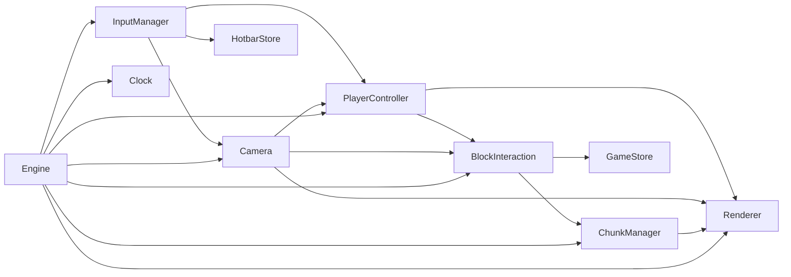

# feat: Add player controller, physics, and block interaction

## Overview

Add first-person player movement with AABB collision, mouse-look camera, block breaking/placing via raycast, a hotbar for block selection, Zustand game state (crystal shard objective), and the main Engine game loop that ties everything together. After this phase, the game is playable.

## Problem Frame

The engine can generate terrain, build meshes, and render chunks — but there is no player, no input, no physics, and no interaction. This phase makes the world interactive: walk, look, jump, break blocks, place blocks, and collect crystal shards.

## Requirements Trace

- R1. InputManager captures keyboard, mouse movement, mouse buttons, and pointer lock
- R2. Camera provides yaw/pitch mouse-look with pitch clamped to ±89 degrees
- R3. PlayerController implements WASD movement at 5 blocks/sec, gravity (20 m/s²), jump (velocity 8), and AABB collision (0.6x1.8x0.6 hitbox)
- R4. AABB collision resolves axis-by-axis (Y first) against solid blocks in a 3x3x3 region
- R5. BlockInteraction raycasts from eye position along look direction (max 6 blocks, 0.1 step) to break/place blocks
- R6. Breaking a crystal block increments the shard counter in game state
- R7. Placing a block must not overlap the player hitbox
- R8. Hotbar holds 8 block types, selectable via keys 1-8 and scroll wheel
- R9. Zustand game store tracks shardsCollected, shardsTotal (5), isComplete, isPaused
- R10. Zustand hotbar store tracks selectedIndex and slots
- R11. Engine game loop runs at requestAnimationFrame rate with capped dt (0.05s max)
- R12. Clock utility provides delta time via performance.now()

## Scope Boundaries

- No UI rendering (React HUD/hotbar components are Phase 6)
- No multiplayer or networking
- No sound
- No inventory beyond the fixed 8-slot hotbar
- No block breaking animation or particles
- No save/load (persistence is a separate phase)
- No crafting

## Context & Research

### Relevant Code and Patterns

- `src/engine/renderer/Renderer.ts` — `updateCamera(position, rotation)`, `render()`, `resize()`
- `src/engine/world/ChunkManager.ts` — `getBlock(wx, wy, wz)`, `setBlock(wx, wy, wz, blockId)`, `update()`, `isFullyLoaded()`
- `src/engine/world/BlockRegistry.ts` — `isSolid(id)`, `getBlock(id)` for collision and interaction checks
- `src/data/blocks.ts` — `BLOCK_ID` constants for hotbar initialization and crystal detection
- `src/engine/world/constants.ts` — `CHUNK_SIZE` for world offset calculations
- `src/lib/Vector3.ts` — available but not required; plain `{x,y,z}` objects are simpler for the physics math

### Institutional Learnings

- Web Worker safety: InputManager, Camera, PlayerController, BlockInteraction run on main thread — Three.js imports are fine in Camera (for `applyToThreeCamera`) but the physics/input code should stay lightweight

## Key Technical Decisions

- **Axis-by-axis collision resolution (Y first)**: Prevents tunneling through corners. Y-first means gravity resolution happens before lateral movement, giving correct onGround detection.
- **Raycast via stepping (0.1 increments)**: Simple, sufficient for block-sized targets at close range. DDA would be more precise but unnecessary for 6-block reach with 0.1 steps.
- **Zustand for game state**: Already a project dependency. Two small stores (game + hotbar) keep concerns separated. Vanilla JS access via `useGameStore.getState()` works from engine code without React.
- **No separate physics engine file**: AABB collision is inlined in PlayerController. The hitbox and gravity constants are small enough that extracting a physics module is premature.
- **Engine class as orchestrator**: Single entry point that creates all subsystems, runs the game loop, and handles disposal. Keeps the React integration surface minimal (just pass a canvas ref).
- **performance.now() Clock**: Browser-native, sub-millisecond precision. Delta cap at 0.05s prevents physics explosions after tab-switch or debugger pause.

## Open Questions

### Resolved During Planning

- **How does BlockInteraction access game state?** Direct Zustand store access: `useGameStore.getState().collectShard()`. No React hooks needed in engine code.
- **How does Engine read hotbar selection?** Direct store access: `useHotbarStore.getState()`. Engine updates hotbar store from input (keys 1-8, scroll) each frame.
- **Where does the player spawn?** (32, 45, 32) — center of the island, above the terrain surface. Y=45 is safely above the max terrain height (~30 + noise) so the player falls to the surface on spawn.

### Deferred to Implementation

- **Exact collision overlap threshold**: Small epsilon for floating-point collision resolution. Implementation decides the value (typically 0.001).
- **Mouse sensitivity default value**: Something around 0.002-0.003 radians per pixel. Tuned during play testing.

## High-Level Technical Design

> *This illustrates the intended approach and is directional guidance for review, not implementation specification. The implementing agent should treat it as context, not code to reproduce.*

### Collision Resolution Shape

> *Directional guidance for the AABB physics, not implementation specification.*

Per frame:
1. Apply gravity to velocity.y
2. Apply WASD input to velocity.x/z (based on camera forward/right)
3. Move Y axis: position.y += velocity.y * dt → check collision → resolve
4. Move X axis: position.x += velocity.x * dt → check collision → resolve
5. Move Z axis: position.z += velocity.z * dt → check collision → resolve

Each axis resolution: expand player AABB, find overlapping solid blocks, push player out of the deepest overlap on that axis.

## Implementation Units

### Phase A: Input and Camera

- [ ] **Unit 1: Clock utility**

  **Goal:** Provide frame delta time for the game loop

  **Requirements:** R12

  **Dependencies:** None

  **Files:**
  - Create: `src/engine/Clock.ts`
  - Test: `src/tests/Clock.test.ts`

  **Approach:**
  - Store last timestamp via `performance.now()`
  - `getDelta()` computes elapsed seconds, caps at 0.05, updates stored timestamp
  - First call returns 0 (or a small default)

  **Patterns to follow:**
  - `src/lib/coords.ts` — simple utility, named export, JSDoc

  **Test scenarios:**
  - Happy path: Two consecutive calls return a positive delta
  - Edge case: Delta is capped at 0.05 even if real elapsed time exceeds it

  **Verification:**
  - Tests pass, `npx tsc --noEmit` passes

- [ ] **Unit 2: InputManager**

  **Goal:** Capture keyboard, mouse movement, mouse buttons, and pointer lock state

  **Requirements:** R1

  **Dependencies:** None

  **Files:**
  - Create: `src/engine/InputManager.ts`

  **Approach:**
  - Keys tracked in `Set<string>` (keydown adds, keyup removes)
  - Mouse delta accumulated between reads; `getMouseDelta()` returns and resets
  - Mouse buttons stored as single-frame flags; `getMouseButton()` returns and resets
  - Pointer lock requested on canvas click; state tracked via `pointerlockchange` listener
  - `dispose()` removes all listeners (store handler refs for cleanup)

  **Patterns to follow:**
  - Standard DOM event listener pattern with bound method references

  **Test expectation:** None — requires DOM/browser environment. Verified through Engine integration.

  **Verification:**
  - `npx tsc --noEmit` passes
  - All public methods have JSDoc

- [ ] **Unit 3: Camera (mouse-look)**

  **Goal:** Convert mouse input into yaw/pitch rotation and apply to Three.js camera

  **Requirements:** R2

  **Dependencies:** None

  **Files:**
  - Create: `src/engine/player/Camera.ts`
  - Test: `src/tests/Camera.test.ts`

  **Approach:**
  - `yaw` and `pitch` in radians; pitch clamped to ±(89 * PI / 180)
  - `getForward()`: `{ x: -sin(yaw), y: 0, z: -cos(yaw) }` (XZ plane only)
  - `getRight()`: `{ x: cos(yaw), y: 0, z: -sin(yaw) }`
  - `getLookDirection()`: includes pitch for raycasting
  - `applyToThreeCamera()`: sets camera position (+ eye height 1.6) and rotation via Euler (pitch, yaw, 0, 'YXZ')

  **Patterns to follow:**
  - `src/lib/Vector3.ts` — math utility pattern (though Camera returns plain objects)

  **Test scenarios:**
  - Happy path: Default yaw=0, pitch=0 → forward is (0, 0, -1)
  - Happy path: Yaw rotated 90° → forward is (-1, 0, 0)
  - Edge case: Pitch clamped at +89° when applying large positive dy
  - Edge case: Pitch clamped at -89° when applying large negative dy

  **Verification:**
  - Tests pass, `npx tsc --noEmit` passes

### Phase B: Player Physics

- [ ] **Unit 4: PlayerController with AABB collision**

  **Goal:** Implement first-person movement with gravity, jumping, and solid block collision

  **Requirements:** R3, R4

  **Dependencies:** Unit 2, Unit 3

  **Files:**
  - Create: `src/engine/player/PlayerController.ts`
  - Test: `src/tests/PlayerController.test.ts`

  **Approach:**
  - Position/velocity as `{x, y, z}` objects; `onGround` boolean
  - Movement: WASD reads camera forward/right, scales to 5 blocks/sec
  - Gravity: `velocity.y -= 20 * dt` when not on ground
  - Jump: `velocity.y = 8` on space when onGround is true
  - Collision: check 3x3x3 block region around player feet; expand to cover 1.8 height
  - Axis resolution order: Y first (sets onGround), then X, then Z
  - Each axis: move, check AABB overlap with solid blocks, push out if overlapping

  **Patterns to follow:**
  - `src/engine/world/BlockRegistry.ts` — `isSolid()` for collision checks

  **Test scenarios:**
  - Happy path: Player falls under gravity when no ground below (position.y decreases)
  - Happy path: Player standing on solid block → onGround is true, velocity.y is 0
  - Happy path: WASD input moves player in camera-relative direction
  - Happy path: Jump sets velocity.y = 8 when onGround
  - Edge case: Jump does nothing when already in air (onGround = false)
  - Edge case: Player cannot walk through solid blocks (position constrained)
  - Edge case: dt capped at 0.05 prevents tunneling through thin walls

  **Verification:**
  - Tests pass with mock getBlock function
  - `npx tsc --noEmit` passes

### Phase C: Block Interaction and State

- [ ] **Unit 5: Zustand stores (game + hotbar)**

  **Goal:** Create game state and hotbar state stores

  **Requirements:** R8, R9, R10

  **Dependencies:** None

  **Files:**
  - Create: `src/store/useGameStore.ts`
  - Create: `src/store/useHotbarStore.ts`
  - Test: `src/tests/stores.test.ts`

  **Approach:**
  - useGameStore: `shardsCollected`, `shardsTotal` (5), `isComplete`, `isPaused` with actions `collectShard`, `resetObjective`, `setPaused`
  - useHotbarStore: `selectedIndex`, `slots` (8 block IDs), actions `select`, `scrollUp`, `scrollDown`, selector `getSelectedBlockId`
  - Both use `create` from Zustand with vanilla access pattern

  **Patterns to follow:**
  - Standard Zustand store pattern

  **Test scenarios:**
  - Happy path: collectShard increments shardsCollected
  - Happy path: collectShard sets isComplete when shardsCollected reaches shardsTotal
  - Happy path: resetObjective resets to 0 collected, isComplete false
  - Happy path: hotbar select(3) sets selectedIndex to 3
  - Happy path: hotbar scrollUp wraps from index 0 to 7
  - Happy path: hotbar scrollDown wraps from index 7 to 0
  - Happy path: getSelectedBlockId returns the block ID at selectedIndex

  **Verification:**
  - Tests pass, `npx tsc --noEmit` passes

- [ ] **Unit 6: BlockInteraction (raycast + break/place)**

  **Goal:** Raycast from player eye to find target block; handle break and place actions

  **Requirements:** R5, R6, R7

  **Dependencies:** Unit 5

  **Files:**
  - Create: `src/engine/player/BlockInteraction.ts`
  - Test: `src/tests/BlockInteraction.test.ts`

  **Approach:**
  - Raycast: start at eye position (playerPos + {0, 1.6, 0}), step 0.1 along lookDir, max 60 steps (6 blocks)
  - Track previousPos (last air position) for block placement
  - Left click: break block (setBlock to AIR); if crystal, call `useGameStore.getState().collectShard()`
  - Right click: place block at previousPos using selected block ID; skip if previousPos overlaps player AABB
  - `getTargetBlock()` returns hit info for future crosshair/highlight rendering

  **Patterns to follow:**
  - `src/engine/world/ChunkManager.ts` — `getBlock()`, `setBlock()` interface

  **Test scenarios:**
  - Happy path: Raycast looking at a solid block at distance 3 → reports hit with correct blockPos
  - Happy path: Left click on stone block → block becomes AIR
  - Happy path: Left click on crystal block → block becomes AIR AND collectShard called
  - Happy path: Right click places selected block at face position
  - Edge case: Right click does nothing if placement position overlaps player hitbox
  - Edge case: Raycast looking at empty space (no solid within 6 blocks) → no hit
  - Edge case: Raycast at max distance → no hit if target is at distance 6.1

  **Verification:**
  - Tests pass with mock ChunkManager/getBlock
  - `npx tsc --noEmit` passes

### Phase D: Engine Integration

- [ ] **Unit 7: Engine game loop**

  **Goal:** Orchestrate all subsystems in a requestAnimationFrame loop

  **Requirements:** R11

  **Dependencies:** Units 1-6

  **Files:**
  - Create: `src/engine/Engine.ts`

  **Approach:**
  - Constructor takes canvas, creates all subsystems
  - `init()` is async: loads atlas, creates ChunkManager, starts loop
  - Game loop per frame: read input → update hotbar selection → update camera → update player → update block interaction → update chunk manager → apply camera to renderer → render
  - Hotbar: keys 1-8 call `useHotbarStore.getState().select(n-1)`; scroll wheel calls scrollUp/scrollDown
  - `dispose()` cleans up all subsystems

  **Patterns to follow:**
  - `src/engine/renderer/Renderer.ts` — async init pattern

  **Test expectation:** None — requires DOM/WebGL/rAF. Verified through manual play testing.

  **Verification:**
  - `npx tsc --noEmit` passes
  - All subsystem types compose correctly

## System-Wide Impact

- **Interaction graph:** Engine orchestrates: InputManager → Camera → PlayerController → BlockInteraction → ChunkManager → Renderer. BlockInteraction also touches useGameStore (crystal collection). HotbarStore is read by Engine each frame.
- **Error propagation:** No async in the game loop (except init). Failed block operations are silent (ChunkManager.setBlock skips if chunk not loaded). No error states that need recovery.
- **State lifecycle risks:** Zustand stores persist across Engine re-creation — need `resetObjective()` on game restart. Pointer lock may not release on dispose — InputManager.dispose must handle this.
- **API surface parity:** ChunkManager.getBlock/setBlock is the only block access interface — used by both PlayerController (collision) and BlockInteraction (raycast).
- **Integration coverage:** The critical chain is Input → Camera → PlayerController → collision → BlockInteraction → ChunkManager.setBlock → re-mesh. This requires end-to-end play testing beyond unit tests.
- **Unchanged invariants:** Renderer, ChunkMeshBuilder, TerrainGenerator, StructureGenerator, Chunk, coords, noise, blocks, BlockRegistry, constants are not modified.

## Risks & Dependencies

| Risk | Mitigation |
|------|------------|
| AABB collision tunneling at high speeds | dt cap at 0.05s limits max displacement to 0.25 blocks/frame. Player speed (5 b/s) at 0.05 dt = 0.25 blocks — well under 0.6 hitbox width. |
| Raycast stepping may miss thin geometry at grazing angles | 0.1 step size vs 1.0 block size means max miss of 0.1 blocks. Acceptable for MVP. |
| Pointer lock browser compatibility | Standard API, widely supported. Fallback: game still works without lock, just harder to control. |
| Zustand store state leaks between game sessions | Engine.dispose must call resetObjective. Document this in Engine's dispose method. |
| Collision with chunk boundaries if adjacent chunk not loaded | ChunkManager.getBlock returns 0 (AIR) for unloaded chunks — player can fall through. Mitigated by loading all 64 chunks at startup before enabling player movement. |

## Sources & References

- Related code: `src/engine/renderer/Renderer.ts`, `src/engine/world/ChunkManager.ts`, `src/engine/world/BlockRegistry.ts`, `src/data/blocks.ts`
- Prior plans: `docs/plans/2026-04-05-004-feat-rendering-pipeline-plan.md`
