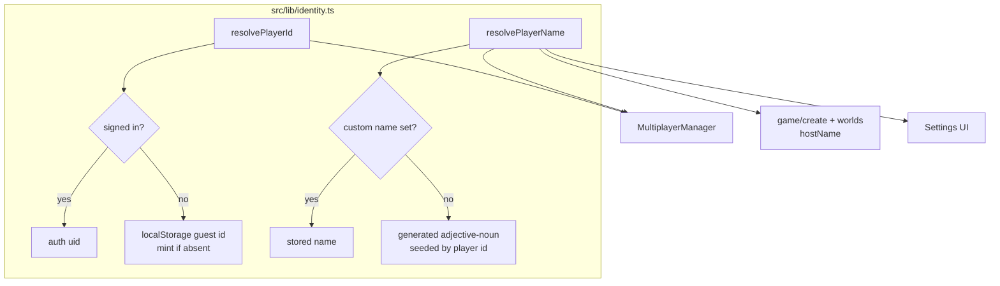

# Account-Free Play - Plan

## Goal Capsule

**Objective.** Let a teen land on Voxelheim and play immediately, and keep building
indefinitely, without ever supplying an email address.

**Product authority.** Ryan (owner). Product decisions in this document are pinned.

**Open blockers.** None. Outstanding Questions are all deferred to planning.

## Product Contract

### Summary

Remove email as a precondition for playing Voxelheim. A visitor lands in a demo
island and plays instantly; creating their own worlds mints a silent anonymous
identity with an auto-assigned display name. Email signup survives only as an
optional convenience, never as a gate. A revisitable in-game walkthrough teaches
controls by doing.

### Problem Frame

Voxelheim targets teens, and their parents object to two things: kids handing an
email address to a website, and not knowing what that site does with the data.
Today the front door asks for exactly that. [src/app/page.tsx:247](src/app/page.tsx:247)
hides "Play Game" behind sign-in and [src/app/worlds/page.tsx:53](src/app/worlds/page.tsx:53)
redirects to `/login`.

The objection is not friction, so a signup form with fewer fields does not answer
it. It is data collection, so the answer is to collect nothing.

The gate is also nearly vestigial. Worlds already live in browser-local IndexedDB
([src/systems/persistence/WorldStorage.ts:31](src/systems/persistence/WorldStorage.ts:31))
and `listWorlds()` ignores who is signed in; `/game` has no auth check at all.
Auth is the only part of Voxelheim that contacts a server on behalf of a player,
which makes the email the entire privacy surface a parent could object to.

### Key Decisions

**Demo is a fast path, not a locked tier.** The demo exists to remove the
landing-page decision, not to withhold the game. It drops the visitor into a
fixed-seed island with the walkthrough running. World creation is absent from the
demo surface, but reaching it costs one click and no credentials.

**Identity is silent.** No name, email, or profile step is ever presented. An
anonymous identity is minted invisibly the first time a player creates a world.
Nothing is asked at any point in the single-player path.

**Display names are auto-assigned, not requested.** Silent identity would
otherwise make every multiplayer participant "Player", which breaks R8 of the
multiplayer contract. A generated two-word name is assigned at identity creation
and editable in settings.

**Demo progress persists.** Demo play writes to the same IndexedDB store as any
other world. Discarding it would be extra work to produce a worse experience.

**Email is demoted, not removed.** Existing email accounts keep working. Signup
and login remain reachable, repositioned as optional sync rather than an
entry requirement.

**Fixed seed for the demo island.** A guided walkthrough cannot reference terrain
that changes per visit.

### Actors

- **Visitor** — arrives with no identity and no history. Wants to see whether the
  game is worth their time.
- **Player** — has created at least one world, therefore holds a silent anonymous
  identity and a generated display name.
- **Parent** — never uses the product. Gates the teen's access by inspecting what
  the site asks for. Success is measured by what they are never prompted to hand over.
- **Returning account holder** — signed up under the current email flow before this
  change.

### Key Flows

**Cold visit through to building.**
Landing page → "Play" → demo island loads with guided steps running → visitor
plays → "Create your own world" → world created, anonymous identity and display
name minted silently in the background → player continues. No prompt appears at
any step.

**First multiplayer session.**
Player hosts or joins → session carries the generated display name → remote
players render with that name above them. No credential is requested. If the
player dislikes their name, settings changes it.

**Returning account holder.**
Signs in as today → lands in the same world list → their existing worlds are
unchanged. The account now grants nothing that anonymous play lacks.

### Requirements

**Demo entry**

- R1. The landing page offers a play action that requires no credentials and loads
  a playable world directly.
- R2. The demo world generates from a fixed seed so it is identical for every visitor.
- R3. The demo surface does not offer world creation; it offers a path to the world
  list, which does.
- R4. Demo progress persists to IndexedDB and is present when the visitor returns
  in the same browser.

**Silent identity**

- R5. Creating a world mints an anonymous identity without presenting any form,
  prompt, or interstitial.
- R6. The identity carries an auto-generated two-word display name.
- R7. The display name is editable from settings.
- R8. No email address is collected on any path that leads to playing or building.

**Walkthrough**

- R9. A guided walkthrough runs on first entry to the demo world, advancing step by
  step as the player performs each action.
- R10. The walkthrough covers movement, breaking a block, placing a block, and
  opening the inventory.
- R11. The walkthrough is re-openable at any time from the pause menu, in any world.
- R12. The walkthrough is dismissible mid-sequence and does not re-trigger on its own
  after being completed or dismissed.

**Multiplayer identity**

- R13. Hosting and joining a session require no email account.
- R14. The session host name derives from the player's display name, not from an
  email address.
- R15. Remote player labels render the display name.

**Existing accounts**

- R16. Existing email accounts continue to authenticate and reach their worlds.
- R17. Signup and login remain reachable but are presented as optional, not as a
  precondition for play.

### Acceptance Examples

- **AE1.** A visitor with cleared storage opens the site, plays the demo for ten
  minutes, closes the tab, and returns the next day in the same browser. Their demo
  world and its block changes are still there. (R4)
- **AE2.** A visitor creates their first world. No dialog, form, or toast asking for
  a name or email appears at any point. (R5, R8)
- **AE3.** Two players who have never signed up join the same session. Each sees the
  other's generated name above their model, and the two names differ. (R6, R13, R15)
- **AE4.** A player completes the walkthrough, then reopens it from the pause menu in
  a different world. It runs there. (R11)
- **AE5.** A player dismisses the walkthrough at step two, leaves, and re-enters the
  demo world. It does not restart on its own. (R12)
- **AE6.** An account created under the current email flow signs in after the change
  and finds the same worlds. (R16)

### Scope Boundaries

**Deferred for later**

- Cross-device and cross-browser world sync. This is the one real job an email
  account would do, and nothing in this change depends on it.
- Upgrading an anonymous identity to an email account while preserving worlds.
- Account recovery for anonymous identities. Clearing browser data loses them, the
  same as today.

**Outside this scope**

- Age gating, parental consent flows, or COPPA-specific disclosure surfaces.
- Changing what the demo island contains beyond fixing its seed.
- Moderation or reporting for multiplayer sessions.

### Dependencies / Assumptions

- Identity is local-only. No Firebase anonymous auth is introduced. The existing
  `guest-<random>` localStorage fallback in
  [src/engine/multiplayer/MultiplayerManager.ts:32](src/engine/multiplayer/MultiplayerManager.ts:32)
  already serves signed-out players, so nothing leaves the device.
- Multiplayer already accepts signed-out players through that fallback, so the
  Firestore and RTDB rules are assumed permissive enough. Rules are not in the repo;
  if a write is rejected for an unauthenticated client, that is an execution-time
  discovery, not a plan-time one.
- [src/app/game/create/page.tsx:97](src/app/game/create/page.tsx:97) and
  [src/app/worlds/page.tsx:93](src/app/worlds/page.tsx:93) derive `hostName` from the
  email local-part. This is the R14 change and an existing leak of the email into
  session data.
- Worlds are not user-scoped today, so no data migration is required for R16.

### Sources / Research

- [src/app/page.tsx:247](src/app/page.tsx:247) — landing page gates play behind sign-in.
- [src/app/worlds/page.tsx:53](src/app/worlds/page.tsx:53) — world list redirects to `/login`.
- [src/systems/persistence/WorldStorage.ts:31](src/systems/persistence/WorldStorage.ts:31) — IndexedDB `voxelheim-db`, not user-scoped.
- [src/store/useAuthStore.ts](src/store/useAuthStore.ts) — auth state, localStorage key `voxelheim_auth`.
- [src/app/api/auth/route.ts](src/app/api/auth/route.ts) — Firebase REST auth proxy.
- [src/engine/multiplayer/MultiplayerManager.ts:32](src/engine/multiplayer/MultiplayerManager.ts:32) — existing `getStablePlayerId` / `getPlayerName`; the identity foundation to extract.
- [docs/brainstorms/2026-04-08-multiplayer-co-op-requirements.md](docs/brainstorms/2026-04-08-multiplayer-co-op-requirements.md) — R2 (auth to join), R8 (names above models).
- [docs/solutions/integration-issues/firebase-auth-vercel-iframe-domain-verification-failure-2026-04-07.md](docs/solutions/integration-issues/firebase-auth-vercel-iframe-domain-verification-failure-2026-04-07.md) — Firebase Auth SDK iframe fails on Vercel; the repo uses REST instead. Reason to avoid adding SDK-based anonymous auth.

---

## Planning Contract

**Product Contract preservation.** Unchanged. Planning resolved the four deferred
questions in place and replaced the Firebase-anonymous-auth assumption with a
local-only identity decision after finding the fallback already implemented.

**Plan depth.** Standard. Seven units, no phasing.

### Key Technical Decisions

**KTD1. Identity is local-only; no Firebase anonymous auth.**
[MultiplayerManager.ts:32](src/engine/multiplayer/MultiplayerManager.ts:32) already
mints `guest-<random>` into localStorage for signed-out players, and multiplayer
already works on that path. Adding `signInAnonymously` would introduce a server round
trip, a uid Voxelheim does not need, and exposure to the Vercel iframe failure the
repo already worked around by moving auth to REST. Local-only also makes the privacy
claim absolute: nothing is transmitted.

**KTD2. Extract identity into `src/lib/identity.ts` plus a Zustand store.**
`getStablePlayerId` and `getPlayerName` are private functions inside the multiplayer
engine, but R6 and R7 make identity a UI concern (settings edits it, the landing page
may greet with it). Extract to a lib module for the pure logic and
`src/store/useIdentityStore.ts` for reactive access, mirroring the
`useSettingsStore` localStorage-persist pattern.

**KTD3. Names are generated adjective-noun pairs from a static vocabulary.**
`getPlayerName()` currently returns the constant `"Guest"` for every signed-out
player, which collides for every participant in a session. A two-word pick from a
static list gives distinguishable, teen-appropriate names with no network call and no
PII. Vocabulary lives in `src/data/playerNames.ts` alongside the existing `src/data/`
content modules.

**KTD4. The demo world is a normal world record with a reserved id and fixed seed.**
Resolves an origin Outstanding Question. A reserved id (`demo-island`) and a constant
seed reuse `WorldStorage`, `saveWorld`, and the existing `/game?worldId=` route
wholesale — no second persistence path, and R4 falls out for free. The demo is
distinguished by id, not by type.

**KTD5. Walkthrough state is per-browser, stored in localStorage.**
Resolves an origin Outstanding Question. Identity is already per-browser, so
per-identity state would be the same key with more indirection. Sits alongside the
existing settings persistence.

**KTD6. Auth demotion is presentational only.**
[src/store/useAuthStore.ts](src/store/useAuthStore.ts),
[src/app/api/auth/route.ts](src/app/api/auth/route.ts), and the login/signup pages are
untouched. R16 holds by not changing the auth path at all; only the gates and the
email-derived name reads change.

### High-Level Technical Design

Identity resolution today is a private ladder inside the multiplayer engine. After
extraction it becomes a shared module every surface reads.

Name generation is seeded by the player id rather than random, so a player's name is
stable across reloads without a second stored value.

---

## Implementation Units

### U1. Extract player identity into a shared module

**Goal.** A single source of truth for player id and display name, readable from UI
and engine alike.

**Requirements.** R5, R6, R7.

**Dependencies.** None.

**Files.**
- `src/lib/identity.ts` (create)
- `src/data/playerNames.ts` (create)
- `src/store/useIdentityStore.ts` (create)
- `src/lib/index.ts`, `src/store/index.ts` (modify — barrel exports)
- `src/tests/identity.test.ts` (create)

**Approach.** Move the `getStablePlayerId` ladder verbatim into
`resolvePlayerId()`. Replace the `"Guest"` constant in the name path with
`generateName(playerId)` — a deterministic adjective-noun pick indexed by a hash of
the id, so the same browser always gets the same name without storing it. A
user-supplied override, when present, wins over the generated name. Persist the
override under its own localStorage key, following the `persistSettings` shape in
[src/store/useSettingsStore.ts:27](src/store/useSettingsStore.ts:27). Guard every
`window` access — this module is imported by SSR-reachable pages.

**Patterns to follow.** `useSettingsStore`'s load/persist pair; `src/data/` module
shape for the vocabulary.

**Test scenarios.**
- `resolvePlayerId` returns the auth uid when a user is signed in.
- `resolvePlayerId` mints and persists a `guest-` id when signed out, and returns the
  same id on a second call.
- `resolvePlayerId` returns a stable non-throwing value when `window` is undefined.
- `generateName` returns the same name for the same player id across calls.
- `generateName` returns different names for two different ids (sample several ids;
  assert distinctness rather than a specific name).
- A stored override takes precedence over the generated name.
- Clearing the override falls back to the generated name, not to `"Guest"`.

**Verification.** `npx tsc --noEmit` clean; identity tests pass.

### U2. Point MultiplayerManager at the shared identity

**Goal.** The engine consumes the extracted module instead of its private copies, so
no session carries an email-derived name.

**Requirements.** R8, R14, R15.

**Dependencies.** U1.

**Files.**
- `src/engine/multiplayer/MultiplayerManager.ts` (modify)
- `src/tests/multiplayer.test.ts` (modify)

**Approach.** Delete the private `getStablePlayerId` and `getPlayerName` (lines
32–53) and import from `src/lib/identity.ts`. Keep the `playerId`/`playerName` fields
so no downstream call site changes. The email branch inside `getPlayerName` is dropped
entirely, not merely deprioritized — R8 forbids the email reaching session data even
for signed-in users.

**Patterns to follow.** Existing field initialization at
[MultiplayerManager.ts:59](src/engine/multiplayer/MultiplayerManager.ts:59).

**Test scenarios.**
- A signed-in user's session payload carries the generated or overridden name, never
  the email local-part.
- Two managers constructed with different player ids broadcast different names.
- Existing multiplayer tests still pass unchanged.

**Verification.** `npm test` passes; no `email` reference remains in the multiplayer
engine.

### U3. Replace email-derived host names

**Goal.** Session creation stops reading the email.

**Requirements.** R8, R14.

**Dependencies.** U1.

**Files.**
- `src/app/game/create/page.tsx` (modify — line 97)
- `src/app/worlds/page.tsx` (modify — line 93)

**Approach.** Both call sites pass `hostName: user?.email?.split("@")[0] ?? "Host"`.
Replace with the resolved display name from the identity store. Drop the now-unused
`useAuthStore` import from `game/create` if nothing else there needs it.

**Test scenarios.** Covered by U2's assertion that no email reaches session data;
these are the two remaining call sites. No new test file.

**Verification.** `grep -rn 'email?.split' src/` returns nothing.

### U4. Remove the play gates

**Goal.** A visitor reaches a playable world with no credentials.

**Requirements.** R1, R3, R17.

**Dependencies.** None.

**Files.**
- `src/app/page.tsx` (modify — the signed-in/signed-out branch at ~line 247)
- `src/app/worlds/page.tsx` (modify — the redirect at ~line 53)

**Approach.** On the landing page, show the play action unconditionally. Demote sign-in
to a secondary link rather than a primary button — resolves an origin Outstanding
Question; R17 requires reachable, not prominent. On the world list, delete the
`router.replace("/login")` effect and the `if (!user) return` guard on the load effect
so worlds load for everyone. `listWorlds()` is already user-agnostic, so nothing else
changes.

**Execution note.** These two edits are what make the feature demonstrable; land them
before the walkthrough units so the rest can be exercised by hand.

**Test scenarios.** Behavioral UI change with no existing page-level test harness —
covered by the manual verification in the Verification Contract rather than by new
automated tests. `Test expectation: none -- no page-render test setup exists in
src/tests/; adding one is out of scope for this plan.`

**Verification.** With `localStorage` and IndexedDB cleared, the landing page shows a
play action and `/worlds` renders without redirecting.

### U5. Demo world entry

**Goal.** The play action lands the visitor in a fixed, identical island.

**Requirements.** R1, R2, R3, R4.

**Dependencies.** U4.

**Files.**
- `src/lib/demoWorld.ts` (create)
- `src/app/page.tsx` (modify — wire the play action)
- `src/tests/demoWorld.test.ts` (create)

**Approach.** `ensureDemoWorld()` checks `WorldStorage` for the reserved id
`demo-island`; if absent, it calls `saveWorld` with the constant seed and the island
spawn position used by
[game/create/page.tsx](src/app/game/create/page.tsx), then returns the id. The play
action awaits it and routes to `/game?worldId=demo-island`. Because it is a normal
world record, R4 persistence is inherited with no extra work, and a returning visitor
short-circuits to the existing record rather than regenerating.

**Patterns to follow.** The `saveWorld` call and `sessionStorage` world-config write in
[game/create/page.tsx](src/app/game/create/page.tsx); the demo must set the same
config key or the canvas will not pick up the seed.

**Test scenarios.**
- Covers AE1. `ensureDemoWorld` creates the record on first call and the seed matches
  the constant.
- Covers AE1. A second call returns the existing record and does not overwrite
  block modifications saved since.
- Two independent first-calls produce identical seed and world type.
- The demo world is created with the island world type and a spawn position inside
  the island footprint.

**Verification.** `npm test` passes; entering the demo twice preserves blocks broken
in the first visit.

### U6. Walkthrough

**Goal.** A guided, revisitable controls tutorial that advances as the player acts.

**Requirements.** R9, R10, R11, R12.

**Dependencies.** U5.

**Files.**
- `src/ui/Walkthrough.tsx` (create)
- `src/store/useWalkthroughStore.ts` (create)
- `src/ui/GameCanvas.tsx` (modify — mount + event wiring)
- `src/ui/PauseMenu.tsx` (modify — re-open control)
- `src/ui/index.ts` (modify — barrel export)
- `src/tests/walkthrough.test.ts` (create)

**Approach.** A store holds an ordered step list, the active index, and a persisted
`completed` flag. Each step declares the player action that satisfies it — move,
break, place, open inventory. `GameCanvas` already owns the input and world callbacks
those steps need; notify the store from the existing handlers rather than adding new
listeners. The overlay renders the active step's prompt and advances on notification.
R12 requires that both completing and dismissing set `completed`, and that entry only
auto-starts when `completed` is false. R11 requires the pause-menu control to reset
the index and open the overlay in any world, not only the demo.

**Patterns to follow.** `PauseMenu`'s button markup and the `MC_BTN` style constants;
`useSettingsStore`'s persistence pair for the `completed` flag.

**Test scenarios.**
- Covers AE5. Dismissing at step two sets `completed`, and a later entry does not
  auto-start.
- Covers AE4. The pause-menu re-open resets to step one and opens the overlay even
  when `completed` is true.
- Notifying the satisfying action advances the active index by one.
- Notifying a non-matching action leaves the index unchanged.
- Completing the final step sets `completed` and closes the overlay.
- Step order is movement, break, place, inventory (R10).

**Verification.** `npm test` passes; the walkthrough advances by playing and reopens
from pause in a non-demo world.

### U7. Name editing in settings

**Goal.** A player can change their auto-assigned name.

**Requirements.** R7.

**Dependencies.** U1.

**Files.**
- `src/app/page.tsx` (modify — the existing settings panel)
- `src/tests/identity.test.ts` (modify)

**Approach.** The landing page already renders a settings panel with `SliderOption`
controls backed by `useSettingsStore`. Add a text input bound to the identity store's
name override, following the same immediate-persist shape. Trim and cap at the 16
characters the multiplayer path already truncates to; an empty value clears the
override and restores the generated name.

**Test scenarios.**
- Setting an override persists it and `resolvePlayerName` returns it.
- An override longer than 16 characters is truncated.
- An empty or whitespace-only override clears back to the generated name.

**Verification.** `npx tsc --noEmit` clean; the name set in settings appears in a
multiplayer session.

---

## Verification Contract

**Automated gates.** All must pass before the work is considered complete.

- `npx tsc --noEmit` — clean.
- `npm run lint` — clean.
- `npm test` — passes, including the new identity, demo-world, and walkthrough suites.

**Manual verification.** U4's gate removal has no test harness, so exercise it by hand
in a browser with storage cleared:

1. Clear localStorage and IndexedDB. The landing page offers play without sign-in.
2. Play lands in the demo island; the walkthrough starts and advances as you move,
   break, place, and open the inventory.
3. Break blocks, leave, return — the blocks are still broken (AE1).
4. Create a world from the world list. No prompt or form appears (AE2).
5. Host a session. The host name is the generated name, not an email fragment (AE3).
6. Reopen the walkthrough from the pause menu in that new world (AE4).
7. Sign in with an existing account. The same worlds are present (AE6).

**Regression watch.** `grep -rn 'email?.split' src/` must return nothing.

---

## Definition of Done

- Every unit U1–U7 is implemented.
- All three automated gates pass.
- The seven manual verification steps pass.
- No path from landing to building requests an email address.
- Existing email accounts still authenticate and reach their worlds.
