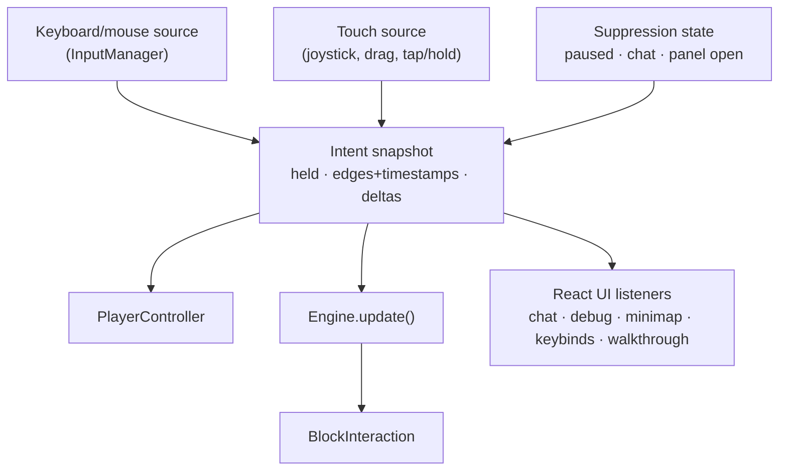
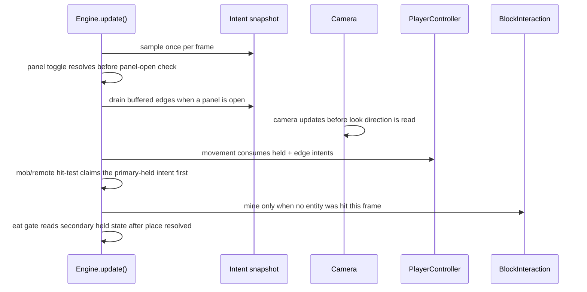

# feat: Touch and tablet input support

## Summary

Route every input through a named-intent layer so keyboard/mouse and touch become interchangeable sources, then build touch controls and touch-adapted UI on top. Work is tiered: a first-playable milestone puts the core loop in a phone player's hands before the remaining parity surface is built.

---

## Problem Frame

The game is unplayable on the devices most of its intended players own. `PlayerController` and `Engine` poll `InputManager` for key codes and mouse buttons at the call site, five React components attach their own `window` keydown listeners, and mouse-look is gated on pointer lock. None of that is reachable with a finger, and there is no seam to add a second input source at.

The refactor is riskier than it looks because input timing is load-bearing in ways the call sites do not advertise. Creative flight toggles on a 300 ms double-tap of Space read at the top of `PlayerController.update()`. Attack and mine are mutually exclusive within a frame purely because the mob hit-test runs before `BlockInteraction`. A right-click is consumed once as an edge for place, then read again as held state for the eat gate later in the same frame. Each of these survives today by accident of ordering, and an intent layer that changes the order breaks them silently.

Requirement IDs `R1`–`R29` are inherited verbatim from the origin document. `R30`–`R31` are new to this plan.

---

## Key Technical Decisions

**One shared intent module, consumed by both `PlayerController` and `Engine`.** `docs/solutions/logic-errors/aabb-max-edge-phantom-block-collision.md` records that physics already lives in three places and states the lesson plainly: duplicated physics is where fixes go to die. Intent resolution split across the controller and the engine loop would rot the same way.

**Jump carries press edges with timestamps, not a boolean.** Creative flight toggles on a 300 ms double-tap window, and Space is simultaneously held-ascend while flying and edge-toggle to exit. A `jump: boolean` intent destroys both. The same physical action needs held and edge readings exposed together (see origin: `docs/brainstorms/2026-09-11-mobile-tablet-support-requirements.md`).

**Left stays level-read; right keeps edge-read plus a separate level-read.** The codebase already runs two temporal models on one physical button — `getMouseButton()` consumes, `isMouseButtonDown()` does not — and left-primary uses only the level path. Unifying them under one getter double-fires place or silently steals it.

**Analog magnitude clamps to 1, with the existing speed constants left as the only scalar.** A joystick supplies a magnitude where keys supplied a normalized vector. Feeding magnitude through unclamped changes per-frame displacement, which feeds sub-stepping and auto-jump's blocked-axis detection.

**Input suppression is an explicit state, not inferred from "no keys held."** `Engine` has a paused/chat-composing branch that runs its own gravity, and the panel-open path drains buffered edges so a click made while inventory was open does not fire a place when it closes. Both need to be states the intent layer owns.

**Desktop quirks are preserved exactly during the refactor.** The debug overlay currently fires while typing in chat, and a right-click buffered during pause places a block after unpause. Both are latent bugs, but fixing them inside a behavior-preserving refactor destroys the one criterion that makes the refactor verifiable. They move to Scope Boundaries, under deferred follow-up work.

**No throwaway spike.** The first-playable tier serves the same de-risking purpose — it puts the gesture grammar in real hands early — without producing code that gets discarded.

**Touch verification is headless.** The in-app browser refuses `requestPointerLock()`, and `vitest.config.ts` runs `environment: "node"`. New input sources follow the existing hand-stub pattern in `src/tests/InputManager.test.ts` rather than introducing jsdom, which would change the environment for all 46 test files.

---

## High-Level Technical Design

Today every consumer reads the device surface directly. The intent layer inverts that: sources produce a snapshot, consumers read the snapshot.

Frame order is a contract, not an implementation detail. These five couplings exist today and must survive:

---

## Requirements

**Input foundation** (inherited R1–R5; R5 already satisfied)

- R1. An intent layer sits between device events and gameplay code, consumed by `PlayerController`, `Engine`, `BlockInteraction`, and the React keyboard listeners.
- R2. Keyboard/mouse and touch are two sources producing the same intent shape.
- R3. The layer expresses held state, edge events, and continuous deltas. Mining and attacking share one primary-held intent resolved by what is targeted.
- R4. Mouse-look no longer requires pointer lock to be held.
- R5. Satisfied — 86 characterization tests committed.

**Touch control scheme** (R6–R13)

- R6. Movement uses a joystick anchored where the thumb first lands in the left region.
- R7. Looking is a drag on the play surface.
- R8. Mining is a hold and placing is a tap, neither with a dedicated button.
- R9. Jump and crouch are stacked buttons in the bottom-right.
- R10. No crosshair in touch mode; the targeted block renders an outline legible on light and dark faces.
- R11. Break progress is visible without being obscured by the acting finger.
- R12. Moving, looking, and pressing a button work as independent simultaneous touches.
- R13. A first touch session surfaces a one-time dismissible hint for the three unlabeled play-surface gestures.

**Touch-adapted UI** (R14–R21)

- R14. Inventory and recipe book open from controls docked at the ends of the hotbar strip.
- R15. Hotbar slots are selectable by tap.
- R16. Interactive targets meet a minimum touch size; the current 20 px slot floor is below it.
- R17. Panels respect safe-area insets and landscape layout.
- R18. Portrait shows a rotate-device prompt rather than a squeezed layout.
- R19. Inventory uses tap to pick up and place, long-press to split, double-tap to quick-move. Long-press-to-split is new behavior needing a desktop trigger too.
- R20. Touch surfaces suppress native double-tap-zoom and long-press callout.
- R21. Slot interaction accepts pointer events and the cursor item follows the active touch.

**Parity gaps** (R22–R26)

- R22. A pause control exists in touch mode without depending on pointer lock.
- R23. Every keyboard-only action has a touch affordance or is explicitly deferred.
- R24. The controls popup and walkthrough are input-source aware; walkthrough step detection observes intents rather than raw `keydown`.
- R25. Chat opens from a touch control and stays usable with the soft keyboard shown.
- R26. Eating keeps its desktop trigger with a longer threshold than mining and a visible, cancellable indicator.

**Device profile** (R27–R29)

- R27. Touch mode arms on first touch event, not user-agent inspection.
- R28. Input source changes at runtime without reload.
- R29. Touch devices resolve their own render and simulation distance defaults.

**Pre-game screens** (new in this plan)

- R30. The title, settings, world-list, and create-world screens are operable by touch. The settings sliders currently respond only to `onMouseDown` plus a `window` `mousemove` listener, which a touch drag never emits.
- R31. Render distance and simulation distance are adjustable on a touch device, since settings is the only surface exposing them and R29 depends on reaching it.
- R32. A human plays a session on a real phone and a real tablet and judges the result playable. Every other requirement here is a parity or absence check — desktop is unchanged, an affordance exists, a gesture produces an intent — and a build can satisfy all of them while being miserable to play. This is the only criterion that asks whether the thing works, and the only one no test and no agent can run. It is also where the reasoned gesture thresholds get replaced with measured ones.

---

## Implementation Units

### Tier 0 — Intent layer

Desktop-only work. Nothing is visibly different at the end of this tier; the characterization suite passing is the deliverable.

### U1. Intent vocabulary and snapshot module

**Goal:** One shared module defining the intent shape and the per-frame snapshot both gameplay consumers read.
**Requirements:** R1, R2, R3
**Dependencies:** none
**Files:** `src/engine/input/intents.ts`, `src/engine/input/snapshot.ts`, `src/tests/intentSnapshot.test.ts`
**Approach:** Three temporal models as distinct accessor shapes — held booleans, an edge queue carrying timestamps, and continuous deltas. Edge entries must be drainable as a group, since the panel-open path depends on discarding buffered edges wholesale. Suppression is a field on the snapshot, not an absence of intents.
**Patterns to follow:** `src/ui/useHudScale.ts` for the pure-function-plus-thin-hook shape already used and tested in this repo.
**Test scenarios:**
- Held intent reads true across consecutive frames without re-press.
- Edge intent is consumed once and absent on the next read.
- Two presses within the double-tap window produce two edges with distinct timestamps; outside the window likewise, so the consumer decides.
- Draining edges clears the queue and leaves held state untouched.
- A suppressed snapshot reports no movement or action intents while still exposing suppression reason.
**Verification:** New unit tests pass; no existing file imports the module yet.

### U2. Keyboard and mouse source

**Goal:** `InputManager` becomes a source feeding the snapshot rather than a surface consumers poll.
**Requirements:** R1, R2, R4
**Dependencies:** U1
**Files:** `src/engine/InputManager.ts`, `src/engine/input/keyboardMouseSource.ts`, `src/tests/InputManager.test.ts`
**Approach:** Preserve both temporal models on the right button — edge for place and panel opens, level for the eat gate — and keep left-primary on the level path. Mouse-look deltas stop being gated on pointer lock while desktop continues to acquire it.
**Execution note:** The existing `InputManager` characterization tests define correct behavior; extend rather than rewrite them.
**Patterns to follow:** `FakeCanvas`/`FakeDocument`/`makeKeyEvent` stubs in `src/tests/InputManager.test.ts`.
**Test scenarios:**
- Right press produces exactly one place edge and, while held, a true eat-gate level read in the same frame.
- Left held produces level-true every frame with no edge consumption.
- Look deltas are produced when pointer lock is not held.
**Verification:** All 86 characterization tests pass unchanged in meaning.

### U3. PlayerController consumes intents

**Goal:** Movement, jump, sneak, sprint, and creative flight read the snapshot.
**Requirements:** R1, R3
**Dependencies:** U1, U2
**Files:** `src/engine/player/PlayerController.ts`, `src/tests/playerControllerInput.test.ts`, `src/tests/collision.test.ts`, `src/tests/autoJump.test.ts`, `src/tests/keybinds.test.ts`
**Approach:** The double-tap flight detector stays in the controller and reads press edges rather than moving into the input layer. Analog magnitude clamps to 1. Per-frame ordering is unchanged: flight toggle, crouch/sprint, camera-relative vector, gravity, jump, Y sub-step, ground probe, X then Z with crouch rollback, overlap resolve, auto-jump impulse last.
**Execution note:** `collision.test.ts` drives `player.update(dt, keys, camera, getBlock, registry)` directly with plain stubs and asserts the AABB invariant every frame. Migrate that harness to the new signature deliberately, keeping per-frame assertions — an end-state-only assertion hides wall-climb.
**Patterns to follow:** `docs/solutions/best-practices/player-physics-movement-architecture-2026-04-10.md` for the frame order.
**Test scenarios:**
- Double-tap Space within the window toggles flight; outside it does not.
- Space held while flying ascends continuously; a single press while grounded jumps once.
- Analog magnitude 1.0 produces displacement identical to a held movement key.
- Analog magnitude above 1 clamps rather than scaling displacement.
- Auto-jump fires on a blocked axis only when grounded, not crouching, not flying.
- AABB invariant holds every frame in all four horizontal directions.
**Verification:** `collision.test.ts`, `autoJump.test.ts`, `playerControllerInput.test.ts` all pass.

### U4. Engine loop consumes intents

**Goal:** `Engine.update()` samples the snapshot once per frame and preserves the five ordering couplings.
**Requirements:** R1, R3
**Dependencies:** U1, U2
**Files:** `src/engine/Engine.ts`, `src/engine/player/BlockInteraction.ts`, `src/tests/engineEatAttack.test.ts`, `src/tests/blockInteractionInput.test.ts`
**Approach:** Panel toggle resolves before the panel-open check; the drain runs before any other consumption; camera updates before look direction feeds the raycast; the entity hit-test claims the primary-held intent before mining can; the eat gate reads secondary held state only after the place edge has resolved. Early-return paths that skip the drain today keep skipping it.
**Test scenarios:**
- A secondary edge buffered while a panel is open does not place when the panel closes.
- Primary held with a mob in range attacks and does not mine, in the same frame.
- Primary held with no entity mines the targeted block.
- Opening and closing a panel takes effect within the frame the toggle was pressed.
- Eat gate reads held secondary state only after place has resolved.
**Verification:** `engineEatAttack.test.ts` and `blockInteractionInput.test.ts` pass; full suite green.

### U5. React listeners consume intents

**Goal:** Chat, debug overlay, minimap toggle, keybinds popup, and walkthrough stop attaching their own `window` keydown listeners.
**Requirements:** R1, R24
**Dependencies:** U1, U2
**Files:** `src/ui/GameCanvas.tsx`, `src/ui/HUD.tsx`, `src/ui/MinimapUI.tsx`, `src/ui/KeybindsPopup.tsx`, `src/ui/Walkthrough.tsx`, `src/tests/keyboardActionInventory.test.ts`
**Approach:** Each listener re-implements a different subset of the same four guards (text field, chat composing, panel open, paused/dead). Centralizing normalizes them. The debug overlay currently has none of these guards and fires while typing in chat; preserve that behavior here and fix it separately, so this unit stays behavior-preserving.
**Patterns to follow:** Keybinds popup uses capture phase for Escape/Enter — preserve that precedence.
**Test scenarios:**
- Chat opens on its key and not while a text field has focus.
- Walkthrough movement step completes from a movement intent rather than a raw key code.
- Keybinds popup still intercepts Escape ahead of other handlers.
- Debug overlay behavior is unchanged, including while chat is composing.
**Verification:** `keyboardActionInventory.test.ts` passes; desktop play unchanged.

### Tier 1 — First playable

At the end of this tier a phone player can reach a world from the title screen, walk, mine, place, switch hotbar slots, and pause. Inventory and the remaining parity surface are not yet touch-adapted.

Order within the tier is U6, U11, U8, U7. The pre-game screens come early because the tier's own exit check — a loop exercised on a real phone — is unreachable without them.

### U6. Touch input source

**Goal:** A second source producing the same intents from touches.
**Requirements:** R2, R6, R7, R8, R12, R20, R27, R28
**Dependencies:** U1, U2
**Files:** `src/engine/input/touchSource.ts`, `src/engine/InputManager.ts`, `src/tests/touchSource.test.ts`
**Approach:** Floating joystick anchored on first contact in the left region; drag-to-look on the play surface; tap-versus-hold classification with a drag threshold that converts a pending hold into a look and cancels break progress. Touch mode arms on first touch event. Compatibility mouse-event suppression lands inside `InputManager.init`, since synthesized events reach the canvas mousedown and the canvas click that requests pointer lock.
**Patterns to follow:** `src/app/dressing-room/page.tsx` is the existing pointer-event precedent in this repo. Stub touch events following `src/tests/InputManager.test.ts`.
**Test scenarios:**
- Tap under the movement and duration thresholds emits a place edge and no primary-held.
- Hold past the threshold emits primary-held continuously.
- Drag past the look threshold during a pending hold cancels it and emits look deltas.
- Three simultaneous contacts drive movement, look, and a button without interference.
- Joystick magnitude never exceeds 1 regardless of drag distance.
- A synthesized mouse event following a touch produces no duplicate intent.
- The play surface suppresses double-tap zoom, the long-press callout, and text selection.
**Verification:** Unit tests pass; desktop suite unaffected.

### U11. Pre-game screens on touch

**Goal:** Title, settings, world list, and create-world are operable by touch.
**Requirements:** R30, R31
**Dependencies:** none — pointer events replace mouse events without touching the intent layer
**Files:** `src/app/page.tsx`, `src/app/worlds/page.tsx`, `src/app/game/create/page.tsx`, `src/tests/settingsSlider.test.ts`
**Approach:** The settings slider is a `div` with `onMouseDown` reading `clientX`, then attaching `window` `mousemove`/`mouseup` — a touch drag emits none of these. Move to pointer events, which covers both sources.
**Test scenarios:**
- Slider drag updates the value from pointer events with no mouse events involved.
- Slider still responds to a mouse drag.
- Drag continuing outside the slider bounds tracks correctly and releases cleanly.
- Render and simulation distance are reachable and settable on a touch viewport.
**Verification:** Settings adjustable end-to-end on a phone.

### U8. Touch mode plumbing and pause decoupling

**Goal:** Pause stops being the pointer-lock-lost callback, and input-source state is observable by the UI.
**Requirements:** R22, R27, R28
**Dependencies:** U6
**Files:** `src/engine/Engine.ts`, `src/store/useGameStore.ts`, `src/ui/PauseMenu.tsx`, `src/tests/inputSourceMode.test.ts`
**Approach:** Pause becomes an explicit intent. Desktop keeps pointer-lock-loss as an additional trigger.
**Test scenarios:**
- Pause fires from the touch control with no pointer lock.
- Desktop still pauses on pointer-lock loss.
- Switching from keyboard to touch and back requires no reload and leaves the keyboard working.
**Verification:** Full suite green; pause reachable on device with no pointer lock.

### U7. Touch HUD overlay

**Goal:** On-screen controls and the touch-mode aim indicator.
**Requirements:** R6, R9, R10, R11, R13, R14, R15, R22
**Dependencies:** U6, U8
**Files:** `src/ui/TouchControls.tsx`, `src/ui/HUD.tsx`, `src/ui/HotbarUI.tsx`, `src/engine/renderer/BlockBreakOverlay.ts`, `src/tests/touchControls.test.ts`
**Approach:** Joystick left, stacked jump/crouch bottom-right, inventory and recipe controls docked at the hotbar ends, small corner icons for chat/map/pause. No crosshair in touch mode; the targeted block outlines instead. Break progress renders away from the acting finger.
**Execution note:** Always-mounted overlay — follow the `CreativeInventoryUI` shape: outer wrapper with a single stable store selector before the early return, inner component owning all other hooks. `docs/solutions/developer-experience/fast-refresh-hook-order-error-on-always-mounted-ui-during-branch-merge.md` records why.
**Test scenarios:**
- Controls render only in touch mode and disappear when the source reverts to keyboard.
- Hotbar tap selects the slot matching the tapped index.
- Crosshair is absent and the block outline present in touch mode.
- Pause control dispatches pause without pointer lock ever having been acquired.
**Verification:** Headless component tests pass; controls within thumb reach in landscape; first-playable loop exercised end-to-end on a real phone, starting from the title screen.

### Tier 2 — Parity

### U9. Inventory touch grammar

**Goal:** Slots respond to touch with the existing transfer semantics.
**Requirements:** R19, R20, R21
**Dependencies:** U6
**Files:** `src/ui/useSlotInteractions.ts`, `src/ui/ItemIcon.tsx`, `src/ui/CraftingTableUI.tsx`, `src/ui/FurnaceUI.tsx`, `src/tests/inventoryConservation.test.ts`, `src/tests/inventoryTransfer.test.ts`
**Approach:** `useSlotInteractions` reads only `e.shiftKey` from the event, so moving to pointer events is a type change plus one gesture classifier; the store mutations underneath are event-agnostic. Touch gestures call the same `quickMove` resolver rather than reimplementing transfer. Consolidate the cursor-item overlay first — `CraftingTableUI` and `FurnaceUI` each duplicate it with their own `mousemove` effect, and touch would add a third copy.
**Execution note:** Pass the whole slot object through the cursor rather than enumerating fields. `docs/solutions/runtime-errors/inventory-tool-system-crash-and-data-loss-2026-04-08.md` records durability silently resetting when one call site omitted a field.
**Test scenarios:**
- Tap picks up a stack; a second tap places it.
- Double-tap quick-moves to the same destination shift-click resolves to.
- Long-press splits a stack; the desktop trigger for split produces the same result.
- Conservation invariant holds across every touch gesture on every screen.
- A gesture abandoned mid-way leaves the cursor item recoverable, not dropped.
- A tool moved by touch retains durability.
**Verification:** Conservation and transfer suites pass with touch paths added.

### U10. Touch-sized panels and orientation

**Goal:** Panels and HUD respect touch target minimums, safe areas, and orientation.
**Requirements:** R16, R17, R18
**Dependencies:** U7
**Files:** `src/ui/usePanelMetrics.ts`, `src/ui/useHudScale.ts`, `src/ui/InventoryUI.tsx`, `src/tests/panelMetrics.test.ts`, `src/tests/hudScale.test.ts`
**Approach:** Both metric modules are pure functions of width and height, so extending them means adding arguments rather than restructuring. The 20 px slot floor rises to the touch minimum; panels scroll when slots at that size no longer fit.
**Test scenarios:**
- No interactive target resolves below the touch minimum at any supported viewport.
- Safe-area insets shift panel bounds when non-zero.
- Portrait resolves to the rotate prompt rather than a squeezed layout.
- Desktop metrics are unchanged at desktop viewports.
**Verification:** Metric tests pass; on-device check at notch and home-indicator edges.

### U12. Remaining parity actions and onboarding

**Goal:** Every keyboard-only action has a touch affordance or an explicit deferral, and first-run onboarding is input-source aware.
**Requirements:** R23, R24, R25, R26
**Dependencies:** U7, U8
**Files:** `src/ui/KeybindsPopup.tsx`, `src/ui/Walkthrough.tsx`, `src/ui/ChatUI.tsx`, `src/ui/MinimapUI.tsx`, `src/tests/keyboardActionInventory.test.ts`, `src/tests/walkthrough.test.ts`
**Approach:** Resolve each of sprint, creative fly, drop, zoom, minimap toggle, debug info, and the third-person camera cycle to an affordance or the deferred list. Eating keeps its held trigger with a longer threshold and a cancellable indicator.

**Resolved.** Each keyboard-only action got an affordance, recorded as data in `src/data/touchParity.ts` rather than as a claim here — one table, read by both the controls popup and the inventory test, so a new bind with no touch answer fails CI:

| Action | Touch |
|---|---|
| Sprint | Double-tap the joystick and keep holding — the control already under the thumb, lasting exactly as long as the contact, so no latch can drift out of step with the overlay |
| Creative fly | Double-tap the Jump button. The button now pushes a `jump` *edge* as well as holding the intent, so `PlayerController`'s existing 300 ms double-tap rule fires unchanged |
| Drop | Press and hold a hotbar slot (600 ms — longer than mine or eat, because this one destroys something) |
| Zoom | Corner icon, toggling. `Engine` latches on the `zoom` edge the vocabulary had already reserved for "a source with no hold to spend" |
| Minimap | Corner icon (already shipped in U7) |
| Debug info | Pause menu. Required lifting `showDebug` out of `HUD`'s local state into the store — pressing the intent from the menu would have worked only because that intent's blocker list is empty, a latent bug the plan defers, so the button would have died the day someone fixed it |
| Change camera | Pause menu, calling the engine directly. An edge pushed while paused stays queued and fires after resuming, so the player would close the menu and only then see the camera move |

Zoom is the only addition to the icon column. The column is the scarcest space on a short landscape screen, which is why the two rare actions went to the pause menu instead.

**Landed early:** R26's producer. `TouchSource` had no way to assert `secondary` as a *level* read — its only hold asserted `primary` and its only `secondary` signal was the tap edge — so the eat gate could never open on a phone, silently, since a closed gate is indistinguishable from a player who is not hungry. A play-surface hold that outlasts `eatHoldThresholdMs` (500 ms, against mining's 200 ms) now asserts `secondary` alongside `primary`, and lifting, cancelling, or sliding into a look drops it. The two never both resolve: the eat gate is already closed whenever the player is aiming at a block. The indicator is the existing eat progress bar. What remains for U12 is the affordance work, not the input.
**Test scenarios:**
- The keyboard-only action inventory test enumerates zero unaddressed actions.
- Controls popup presents touch affordances in touch mode.
- Walkthrough movement step completes from a joystick drag.
- Eat cancels when the finger lifts before completion.
- Eat does not begin until past its threshold when aim drifts off a block mid-mine.
- Chat stays usable with the soft keyboard shown in landscape.
**Verification:** Parity inventory test green; walkthrough completable end-to-end on a phone.

### U13. Device performance profile

**Goal:** Touch devices resolve their own render and simulation distance defaults.
**Requirements:** R29
**Dependencies:** U11
**Files:** `src/store/useSettingsStore.ts`, `src/engine/world/constants.ts`, `src/tests/deviceProfile.test.ts`
**Approach:** Measure on a real mid-range device before choosing values — this is the assumption carried from the origin's blocking question. If the binding constraint is meshing or GC rather than distance, record that and revisit the requirement rather than shipping a distance change that does nothing.
**Execution note:** There is no prior art in `docs/solutions/` on meshing budgets or distance tuning. Capture the measurement as a learning afterward.

**Built as mechanism, not as measurement.** The resolution path is complete and tested — a device profile applies when the source changes (R28), a distance the player picks is pinned and survives both a reload and every later profile, and desktop values are untouched. The two touch numbers in `src/engine/world/deviceProfile.ts` are **provisional**: 5 and 4 against desktop's 8 and 6, chosen to be conservative rather than right. They sit in one place so the measurement session replaces two lines.

The larger assumption is untouched and must be checked first: that *distance* is the binding constraint at all. If a phone is limited by meshing throughput or GC pauses, these values cost draw distance and buy nothing, and R29 is aimed at the wrong lever.

**What the mechanism cost:** `saved ?? default` could not express this. The store persists every field on any change, so a number was on disk whether or not the player chose it — moving the music slider was enough to make a render distance look deliberate. A device profile on top of that would either never apply or would silently discard a real choice. The pin is now recorded separately from the value.
**Test scenarios:**
- Touch mode resolves lower defaults than desktop.
- An explicit user setting overrides the device default and survives reload.
- Lowering render distance does not leave stale chunk meshes at the new boundary.
**Verification:** Measured frame rate meets the floor named during measurement.

---

## Scope Boundaries

**Deferred for later**

- Gamepad support. The intent layer makes it cheap afterward; no gamepad source ships here.
- A key-rebinding UI. `src/data/keybinds.ts` becomes rebindable in principle once intents exist.
- Portrait gameplay. Landscape only; R18 covers the entry state, not a portrait layout.
- Touch-specific multiplayer features.

**Deferred to follow-up work**

- Fixing the debug overlay firing while chat is composing.
- Deciding whether a secondary edge buffered during pause should survive unpause.

**Outside this effort**

- A native app wrapper or app-store distribution.
- Redesigning the game's visual identity for mobile.

---

## Risks and Dependencies

- **Ordering regressions are silent.** The couplings in `Engine.update()` produce no error when broken — place stops working, or attack and mine both fire. The characterization suite is the only detector.
- **`collision.test.ts` migration is the highest-risk edit in Tier 0.** It is the mechanism proving the AABB max-edge fix still holds, and its harness breaks by construction when `PlayerController.update()` changes signature.
- **Analog movement feeds physics.** Sub-stepping and auto-jump both derive from per-frame displacement.
- **Hook-order errors during development.** Always-mounted touch overlays reproduce a known Fast Refresh failure; restart the dev server rather than debugging a stale module.
- **Performance targets are unmeasured.** R29's lever may be aimed at the wrong constraint.
- Depends on the dev-origins fix (`e1ef666`) for any on-device dev testing.

---

## Open Questions

**Deferred to implementation**

- The exact touch target minimum, and whether panels scroll or reflow at that size.
- Whether the recipe book needs its own dock control or becomes a tab inside inventory.
- Whether jump and crouch briefly interrupt the look-drag with the same thumb, or a genuine third contact is expected.
- Which of sprint, creative fly, drop, zoom, minimap toggle, and debug info get affordances versus deferral.

**Assumptions carried from the origin's blocking questions**

- Performance: the reference device and frame-rate floor are unnamed, and whether distance is the binding constraint is unverified. Validated inside U13.
- Inventory gesture grammar: long-press against panel scrolling, double-tap quick-move, and hold-versus-drag under break progress were never exercised on a device. Validated inside U9.

---

## System-Wide Impact

- Every gameplay input path changes. Desktop parity rests entirely on the characterization suite.
- Pointer lock stops being load-bearing for look and pause, while remaining the desktop path.
- `CONCEPTS.md` has no Input or Intent entry; the intent vocabulary should be added once U1 settles the terms.
- The `.ai-codex/` indexes need regenerating after new modules land.

---

## Sources and Research

- Origin: `docs/brainstorms/2026-09-11-mobile-tablet-support-requirements.md`
- `docs/solutions/best-practices/player-physics-movement-architecture-2026-04-10.md` — per-frame order inside `PlayerController.update()`, including the double-tap flight window.
- `docs/solutions/logic-errors/aabb-max-edge-phantom-block-collision.md` — the collision harness shape and the duplicated-physics lesson.
- `docs/solutions/developer-experience/fast-refresh-hook-order-error-on-always-mounted-ui-during-branch-merge.md` — always-mounted UI hook ordering, and why game screens are verified headless.
- `docs/solutions/runtime-errors/inventory-tool-system-crash-and-data-loss-2026-04-08.md` — the cursor-item chokepoint and durability loss.
- `docs/solutions/logic-errors/stale-chunk-mesh-on-neighbour-unload-2026-09-04.md` — relevant only if render distance becomes device-dependent.
- `CONCEPTS.md` — Quick-Move, Slot Region, and the conservation invariant.
- `AGENTS.md` — this is a modified Next.js; read `node_modules/next/dist/docs/` before writing app-router or viewport code.
